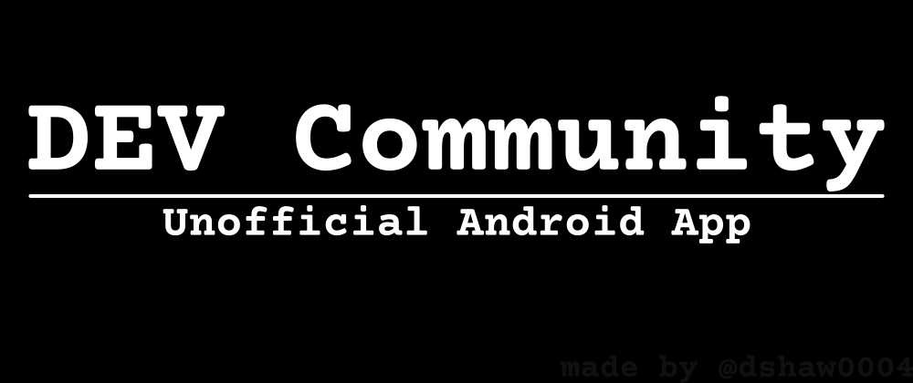

# DEV Communit Android App (Beta)

Unofficial android app of [dev.to](https://dev.to).

## Version

**v0.0.1(beta)**,
Currently this app is in development.
You can download the beta version from my [app store](https://appbucket.vercel.app)

## Features

- It can serve latest posts from dev.to in a very ugly interface. 
- User can click on any post to read it.
- more will be added in future version.

## ToDo

### What to add first 

- [ ] improve the styling of post content
- [ ] show reaction count

### What's to do second 

- [ ] Improve the UI.
- [ ] add the ability to filter posts by tags
- [ ] replace loading circle with loading skeleton
- [ ] optimize it for rendering large list
- [ ] think what can be improved

## License

## Tech Stack

**Client:** React Native, Expo, React-Native-Paper

## Authors

- [@dshaw0004](https://www.github.com/dshaw0004)

## Feedback

If you have any feedback, please reach out to us at [my mail](mailto:dipankarshaw692@gmail.com)

## Used By

This project is used by the followings:

- Me
